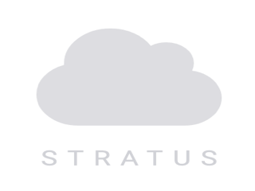

# Stratus — A Modern Roundcube Skin

**Stratus** is a custom skin for [Roundcube Webmail](https://roundcube.net/) that extends the built-in `elastic` skin with an "Atmospheric Modern" design language — layered elevation, fluid transitions, and an indigo color palette with full dark mode support.



## Features

- 🎨 **Indigo color palette** with gradient accents
- 🌙 **Full dark mode** (uses elastic's native `html.dark-mode` system)
- ✨ **Frosted glass** effects (backdrop-filter) on key surfaces
- 💫 **Fluid 150ms transitions** on all interactive elements
- 📱 **Responsive** — inherits elastic's mobile/tablet layout
- 📅 **Calendar polish** — decluttered ghost grid, floating event cards
- 🔤 **System font stack** — zero font loading, native OS feel
- ♿ **prefers-reduced-motion** support

## Quick Start

### Prerequisites

- [Docker Desktop](https://www.docker.com/products/docker-desktop/) (for the dev environment)
- [Node.js](https://nodejs.org/) v18+ (for LESS compilation)
- Git

### Setup (one command)

```bash
git clone --recurse-submodules <your-repo-url>
cd stratus-skin
./scripts/setup.sh      # clones Roundcube, symlinks skin, generates config
./start-dev.sh           # starts Docker containers
```

Open http://localhost:8000 and log in:

| Account | Password |
|---|---|
| `victor@example.test` | `password123` |
| `alice@example.test` | `password123` |
| `bob@example.test` | `password123` |

### LESS Development

```bash
npm run less:watch       # auto-recompile on save
npm run less:build       # one-shot compile
```

The compiled CSS lands in `skins/stratus/styles/styles.min.css`.

## Project Structure

```
├── skins/
│   └── stratus/              ← THE SKIN (source of truth)
│       ├── meta.json         ← extends elastic, dark_mode_support
│       ├── styles/           ← LESS partials → compiled CSS
│       ├── templates/        ← Roundcube template overrides
│       ├── plugins/          ← Plugin template overrides
│       ├── images/           ← logo.svg, etc.
│       └── js/               ← Client-side JS
├── plugins/                  ← Custom Roundcube plugins (Phase 2)
├── config/
│   └── config.inc.php.dist  ← Config template (no secrets)
├── docker/
│   ├── docker-compose.yml   ← Dev environment (mailserver + Roundcube)
│   ├── Dockerfile           ← PHP 8.2 + Apache + Node.js + Composer
│   ├── docker-entrypoint.sh ← Auto-init: DB, users, deps, CSS compile
│   └── docker-data/         ← Mail server accounts & config
├── scripts/
│   ├── setup.sh             ← One-command developer onboarding
│   └── generate-thumbnail.js
├── .github/
│   ├── agents/              ← AI agent definitions (builder, stylist, etc.)
│   ├── instructions/        ← Coding conventions for each file type
│   ├── memory/              ← Project state, decisions, roadmap
│   └── prompts/             ← Reusable AI prompts (/build-next, etc.)
├── roundcubemail/            ← Git submodule → upstream Roundcube v1.6.x
├── start-dev.sh             ← Quick start: setup + docker compose up
├── package.json             ← LESS build scripts
├── CONTRIBUTING.md
└── README.md                ← You are here
```

### What's custom vs. upstream?

| This repo (tracked) | Upstream Roundcube (submodule, not tracked) |
|---|---|
| `skins/stratus/` | `roundcubemail/skins/elastic/` |
| `plugins/stratus_helper/` (Phase 2) | `roundcubemail/plugins/*` |
| `docker/`, `config/`, `scripts/` | `roundcubemail/program/`, `roundcubemail/vendor/` |
| `.github/` (agents, memory) | Everything else in `roundcubemail/` |

## How It Works

Stratus extends elastic via `"extends": "elastic"` in `meta.json`. This means:

1. **Templates** — Elastic's templates are inherited. We only override `layout.html` (to inject our CSS) and `login.html` (custom login page). Everything else comes from elastic automatically.
2. **Styles** — Our `styles.less` imports elastic's full stylesheet first, then layers our variable overrides and custom partials on top.
3. **Dark mode** — Uses elastic's native `html.dark-mode` class + `@color-dark-*` variables. Our `_dark.less` adds supplemental rules.

## Proprietary Plugins (xskin, xframework)

This project does **not** depend on or include the proprietary `xskin`/`xframework` plugins from Roundcube Plus. The skin is fully standalone. If you have licenses for those plugins, you can add them to your local `roundcubemail/plugins/` directory — they won't conflict.

## AI-Assisted Development

This project includes AI agent definitions in `.github/agents/` for use with GitHub Copilot:

- **`@builder`** — Primary agent: reads roadmap, builds, compiles, validates, updates memory
- **`@stylist`** — Color palettes, typography, visual polish
- **`@templater`** — Roundcube template overrides
- **`@plugin-dev`** — PHP companion plugin (Phase 2)

See [CONTRIBUTING.md](CONTRIBUTING.md) for details.

## License

Creative Commons Attribution-ShareAlike 3.0 (CC BY-SA 3.0) — see [skins/stratus/LICENSE](skins/stratus/LICENSE).
