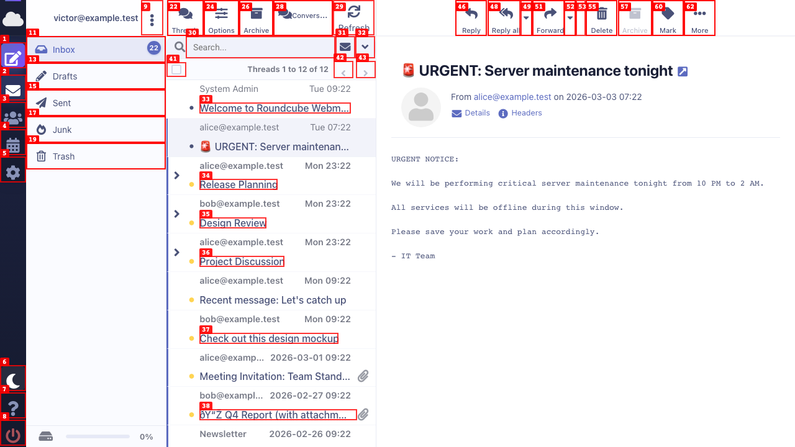
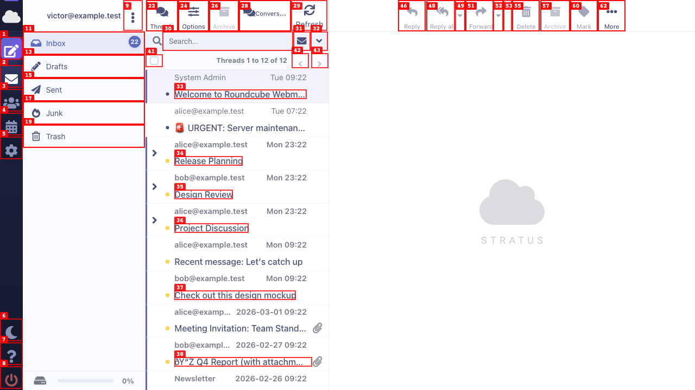
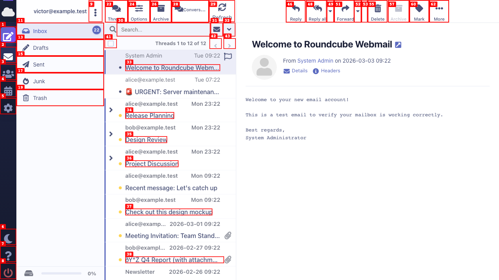
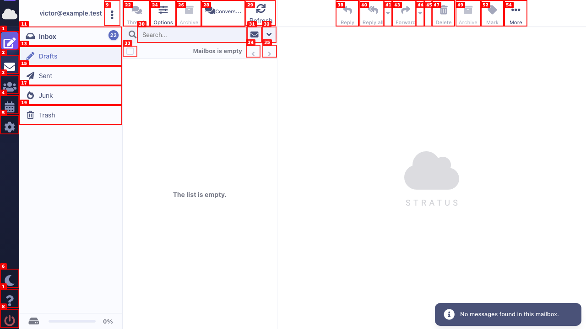
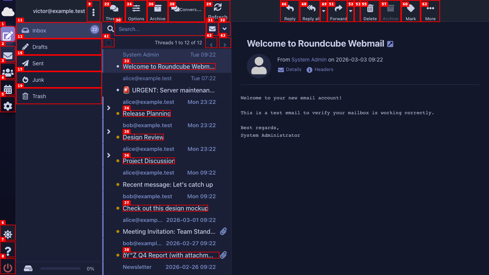

# Dogfood Report: `#layout-list` UX Analysis

| Field | Value |
|-------|-------|
| **Date** | 2026-03-08 |
| **App URL** | http://localhost:8000 |
| **Session** | layout-list |
| **Scope** | Focused UX analysis of `#layout-list` element only |

## Summary

| Severity | Count |
|----------|-------|
| Critical | 0 |
| High | 2 |
| Medium | 5 |
| Low | 4 |
| **Total** | **11** |

## Issues

---

### ISSUE-001: Mass-action bar shows raw localization keys instead of labels

| Field | Value |
|-------|-------|
| **Severity** | high |
| **Category** | content |
| **URL** | http://localhost:8000/?_task=mail&_mbox=INBOX |
| **Repro Video** | N/A |

**Description**

Three buttons in the footer mass-action bar display raw Roundcube localization key names instead of human-readable labels:

1. **Archive button** shows `[buttontext]` — the `<roundcube:label name="buttontext" domain="archive" />` tag is failing to resolve. The label key name `buttontext` in the `archive` plugin domain either doesn't exist or the archive plugin's localization is not loaded.
2. **Mark unread button** shows `markunread` — the raw key is displayed (no brackets, suggesting partial resolution). Expected: "Mark as unread" or similar.
3. **Flag button** shows `markflagged` — same issue. Expected: "Flag" or "Mark as flagged".

**Repro Steps**

1. Log in and navigate to Inbox
   

2. **Observe:** The footer bar at the bottom of `#layout-list` shows `[buttontext]`, `markunread`, `markflagged` as button labels instead of proper localized text.

---

### ISSUE-002: No visible row separators between messages — rows blend together

| Field | Value |
|-------|-------|
| **Severity** | medium |
| **Category** | visual / ux |
| **URL** | http://localhost:8000/?_task=mail&_mbox=INBOX |
| **Repro Video** | N/A |

**Description**

Row separators exist (`1px solid rgba(240, 242, 248, 0.6)`) but are nearly invisible against the white background. The 60% opacity on an already very light gray (`#f0f2f8`) makes the border practically imperceptible, especially on non-Retina displays. Without clear row boundaries, the 3-line layout (from / date / subject) makes it hard to tell where one message ends and the next begins.

Modern email clients like Gmail, Outlook, and Apple Mail all have clearly visible (but subtle) row separators. The current implementation is *too* subtle.

**Expected:** A slightly more visible separator — e.g., `fadeout(@color-list-border, 20%)` instead of 40%, or a solid `1px` in a low-contrast but visible gray.

**Repro Steps**

1. Navigate to Inbox with messages
   

2. **Observe:** Rows run into each other — the separator lines between messages are nearly invisible.

---

### ISSUE-003: Selected/focused row has very weak visual distinction

| Field | Value |
|-------|-------|
| **Severity** | medium |
| **Category** | ux |
| **URL** | http://localhost:8000/?_task=mail&_mbox=INBOX |
| **Repro Video** | N/A |

**Description**

The focused/selected row uses `background: rgba(92, 107, 192, 0.04)` — a 4% opacity indigo wash. This is almost indistinguishable from the non-selected rows, especially since hover also uses a nearly identical background (`fadeout(@color-main, 96%)` = also ~4% opacity).

The only differentiator is a very subtle box-shadow (`rgba(26, 31, 54, 0.05) 0px 1px 2px`), which is also nearly invisible.

**Expected:** The selected row should have a clearly distinguishable background. Suggestions:
- Increase opacity to 8-12% for selected state: `rgba(92, 107, 192, 0.08)` or `0.10`
- Add a left border accent on the selected row (3px indigo, matching the unread indicator)
- Or use a combination: slightly stronger bg + left accent

**Repro Steps**

1. Click on a message to select it
   

2. **Observe:** The selected row ("Welcome to Roundcube Webmail") is almost indistinguishable from the other rows.

---

### ISSUE-004: Thread expand/collapse icon has `cursor: default` instead of `pointer`

| Field | Value |
|-------|-------|
| **Severity** | low |
| **Category** | ux |
| **URL** | http://localhost:8000/?_task=mail&_mbox=INBOX |
| **Repro Video** | N/A |

**Description**

The thread expand/collapse toggle (`.collapsed` / `.expanded` div in `td.threads`) uses `cursor: default`. Since this is a clickable interactive element that expands a thread, it should use `cursor: pointer` to signal interactivity.

**Expected:** `cursor: pointer` on `.threads .collapsed, .threads .expanded`.

---

### ISSUE-005: Empty folder state is bare and unhelpful

| Field | Value |
|-------|-------|
| **Severity** | medium |
| **Category** | ux |
| **URL** | http://localhost:8000/?_task=mail&_mbox=Drafts |
| **Repro Video** | N/A |

**Description**

When navigating to an empty folder (e.g., Drafts), the `#layout-list` shows a plain text "The list is empty." in `color: rgb(118, 121, 134)` with no icon, no illustration, and no helpful guidance. The message has no vertical centering within the 591px tall content area — it appears at the top.

Modern email clients show friendly empty states with:
- A centered icon or illustration
- A brief contextual message (e.g., "No drafts yet — start composing")
- Visual vertical centering

**Expected:** A styled empty state with an icon and vertically centered layout.

**Repro Steps**

1. Click on "Drafts" folder
   

2. **Observe:** "The list is empty." text is plain, top-aligned, and provides no helpful context.

---

### ISSUE-006: Unread vs. read row visual distinction relies only on left border accent

| Field | Value |
|-------|-------|
| **Severity** | medium |
| **Category** | ux |
| **URL** | http://localhost:8000/?_task=mail&_mbox=INBOX |
| **Repro Video** | N/A |

**Description**

The only visual difference between read and unread messages is:
- **Unread:** 3px indigo left border + slightly bolder sender name (`font-weight: 600` vs `400`)
- **Read:** transparent left border + normal weight sender

The **subject line has the same font-weight (500) and color for both states**. The background is identical (transparent). In a busy inbox, it's hard to quickly scan and identify which messages are unread.

Gmail uses bold subject text + bold sender + a slight background tint. Outlook uses bold + a colored dot. Apple Mail uses a blue dot indicator.

**Expected:** Stronger differentiation for unread messages — options include:
- Bold the subject line (`font-weight: 600` or `700`) for unread
- Add a subtle background tint to unread rows (e.g., `rgba(92, 107, 192, 0.02)`)
- Add a small unread dot/indicator near the sender name

---

### ISSUE-007: Mass-action bar buttons always visible (should be hidden until selection)

| Field | Value |
|-------|-------|
| **Severity** | high |
| **Category** | ux |
| **URL** | http://localhost:8000/?_task=mail&_mbox=INBOX |
| **Repro Video** | N/A |

**Description**

The mass-action bar at the bottom of `#layout-list` shows all action buttons (Delete, [buttontext], Move to..., markunread, markflagged, More) at all times, even when no messages are selected. The bar is not in `mp-mass-active` or `mp-mass-enabled` state, yet the buttons are displayed with `display: flex` and `opacity: 1`.

This creates a cluttered, confusing footer. The action buttons (Delete, Archive, Move to, Mark, Flag) have no meaning when nothing is selected. They should only appear when one or more messages are checked.

The implementation has the CSS state classes (`mp-mass-enabled`, `mp-mass-active`) but they don't appear to be controlling visibility correctly — all buttons render regardless.

**Expected:** In the default (idle) state, only the checkbox trigger and pagination info (count + prev/next) should be visible. Action buttons should appear only when `mp-mass-active` is set (i.e., messages are selected).

**Repro Steps**

1. Navigate to Inbox — no messages selected
   

2. **Observe:** Delete, [buttontext], Move to..., markunread, markflagged, More — all visible even with nothing selected.

---

### ISSUE-008: Searchbar "unread" filter button has no label or tooltip

| Field | Value |
|-------|-------|
| **Severity** | low |
| **Category** | ux / accessibility |
| **URL** | http://localhost:8000/?_task=mail&_mbox=INBOX |
| **Repro Video** | N/A |

**Description**

In the searchbar area below the header, there's a button with class `button unread` that displays as an icon without any visible text or tooltip. It appears to be a filter for unread messages, but there's no accessible label or hover title to explain its function.

**Expected:** Add `title="Show unread messages"` and an `aria-label` for accessibility.

---

### ISSUE-009: Header "Inbox" title is hidden on desktop (display: none)

| Field | Value |
|-------|-------|
| **Severity** | low |
| **Category** | ux |
| **URL** | http://localhost:8000/?_task=mail&_mbox=INBOX |
| **Repro Video** | N/A |

**Description**

The `Inbox` element inside `#messagelist-header` has `display: none` on desktop. While the folder list sidebar shows which folder is selected, having the folder name visible in the list header would reinforce context, especially when the sidebar is collapsed or when scanning quickly. This is a minor missing polish — modern clients (Gmail, Outlook) show the folder/category name in the list header.

**Expected:** Consider showing the folder name in the header when there's room, or in the searchbar area.

---

### ISSUE-010: Dark mode row separators are too dark / invisible

| Field | Value |
|-------|-------|
| **Severity** | medium |
| **Category** | visual |
| **URL** | http://localhost:8000/?_task=mail&_mbox=INBOX (dark mode) |
| **Repro Video** | N/A |

**Description**

In dark mode, row separators compute to `1px solid rgba(30, 35, 64, 0.5)`. Against the dark background (`rgb(26, 31, 54)`), these are extremely close in luminance and effectively invisible. The same "too subtle" problem as light mode (ISSUE-002) but worse in dark mode because the separator color is almost identical to the background.

**Expected:** Use `@color-dark-list-border` with less fadeout, or use a lighter border color that provides more contrast against the dark background (e.g., `rgba(60, 70, 120, 0.3)`).

**Repro Steps**

1. Toggle dark mode and view Inbox
   

2. **Observe:** Row separators are invisible in dark mode — messages run into each other.

---

### ISSUE-011: Size column hidden but date always shown — good decision, but "size" data is wasted space in DOM

| Field | Value |
|-------|-------|
| **Severity** | low |
| **Category** | ux |
| **URL** | http://localhost:8000/?_task=mail&_mbox=INBOX |
| **Repro Video** | N/A |

**Description**

The `span.size` element is correctly hidden with `display: none !important`, and `span.date` is forced visible with `display: block !important`. This is a good UX decision — the date is far more useful than the size.

However, the size data is still rendered in the DOM and occupies invisible space. This is a very minor observation — no action needed unless a future redesign considers adding a message preview snippet (2nd line) in the space currently used by size.

**Opportunity:** Consider using the available row space for a 1-line message preview/snippet instead of hiding the size. This would add significant value for scanning messages.

---

## UX Improvement Recommendations (Summary)

### High Priority
1. **Fix localization keys** in mass-action bar — `[buttontext]`, `markunread`, `markflagged` (ISSUE-001)
2. **Fix mass-action bar visibility** — hide action buttons when no messages selected (ISSUE-007)

### Medium Priority
3. **Increase row separator visibility** — both light and dark mode (ISSUE-002, ISSUE-010)
4. **Strengthen selected row visual** — more contrast on selected/focused state (ISSUE-003)
5. **Improve unread/read distinction** — bold subjects, optional background tint (ISSUE-006)
6. **Design better empty states** — centered icon + contextual message (ISSUE-005)

### Nice-to-Have
7. **Thread expand cursor** — change to `pointer` (ISSUE-004)
8. **Searchbar filter button** — add tooltip/aria-label (ISSUE-008)
9. **Show folder name in list header** on desktop (ISSUE-009)
10. **Message preview snippet** — use row space for 1-line preview (ISSUE-011)
