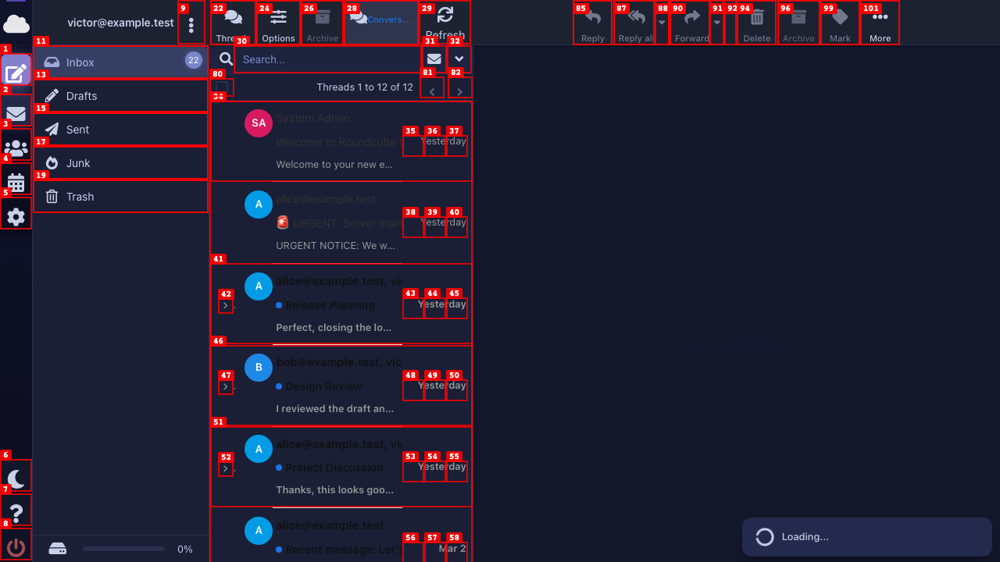
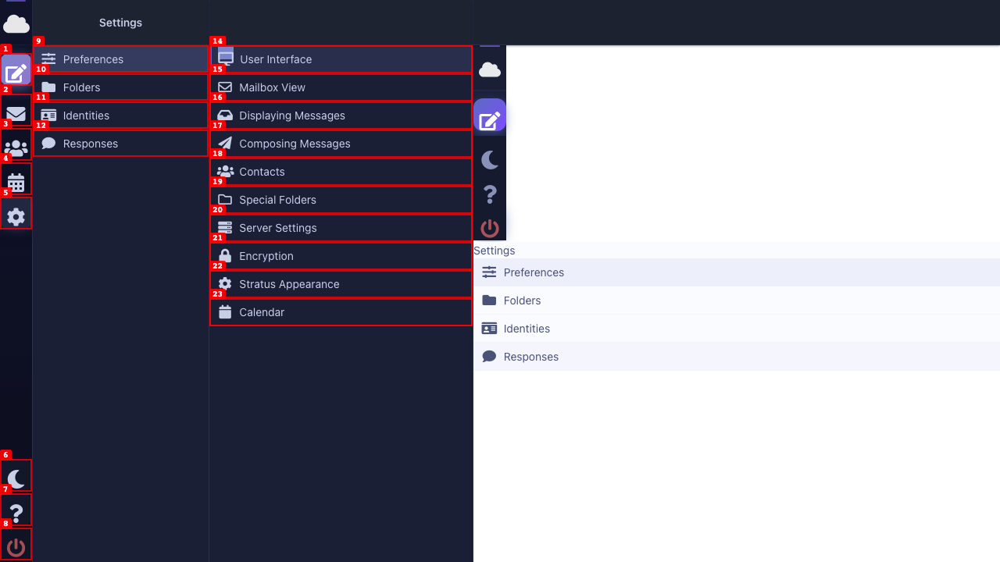
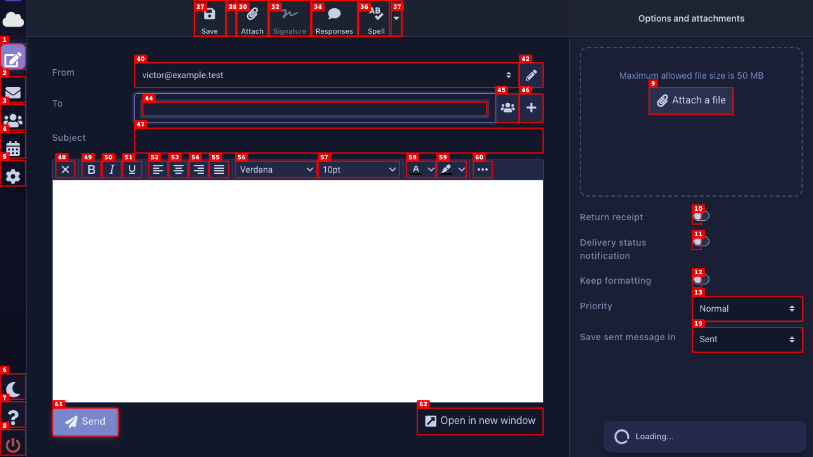
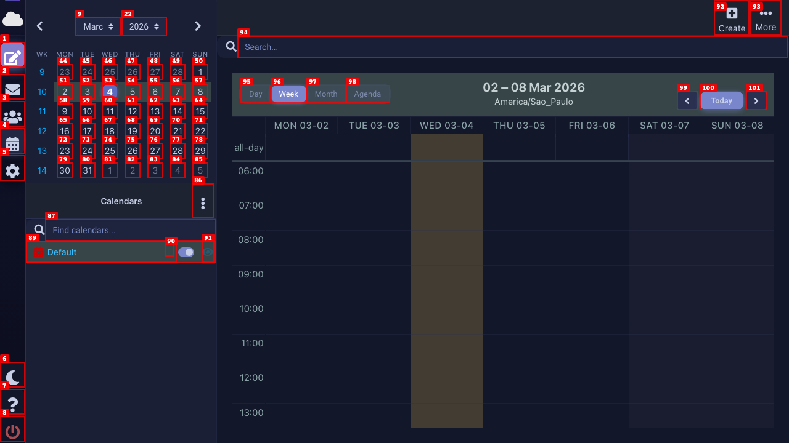
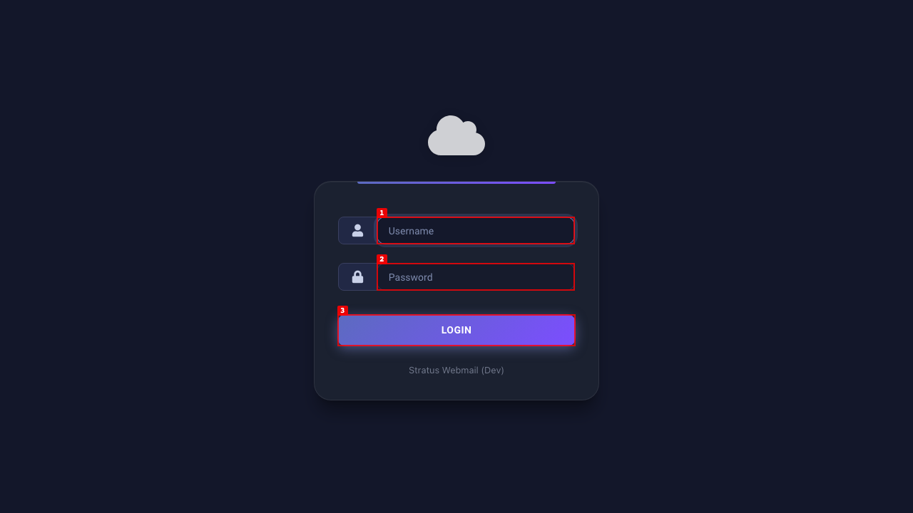
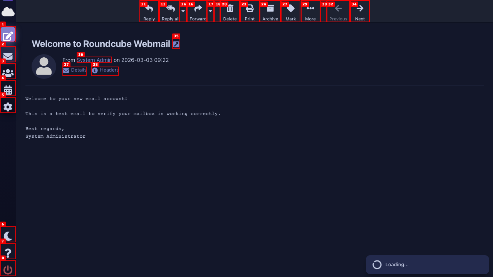
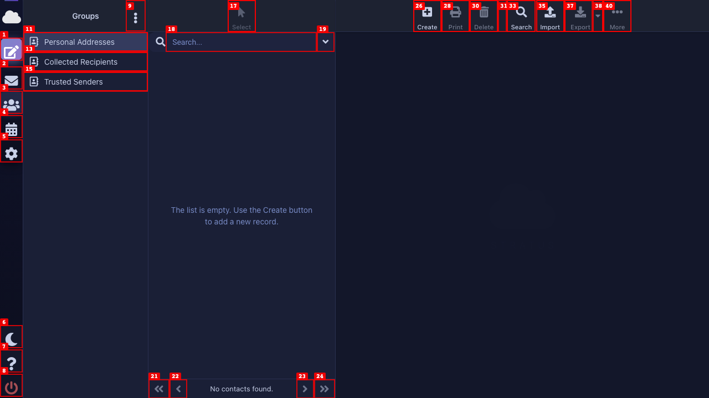

# Dogfood Report: Stratus Dark Mode — All Views

| Field | Value |
|-------|-------|
| **Date** | 2026-03-04 |
| **App URL** | http://localhost:8000 |
| **Session** | stratus-darkmode |
| **Scope** | Visual verification of dark mode on all views: Login, Mail list, Message view, Settings, Calendar, Compose, Contacts |

## Summary

| Severity | Count |
|----------|-------|
| Critical | 0 |
| High | 3 |
| Medium | 1 |
| Low | 1 |
| **Total** | **5** |

## Views Tested

| View | Status | Issues Found |
|------|--------|--------------|
| Login | ✅ Pass | 0 |
| Mail list | ⚠️ Issues | 1 |
| Message view | ✅ Pass | 0 |
| Settings | ⚠️ Issues | 1 |
| Calendar | ⚠️ Issues | 1 |
| Compose | ⚠️ Issues | 1 |
| Contacts | ✅ Pass | 0 |

---

## Issues

### ISSUE-001: Conversation mode — `.conv-sender` name nearly invisible in dark mode

| Field | Value |
|-------|-------|
| **Severity** | high |
| **Category** | visual / accessibility |
| **View** | Mail list |
| **URL** | http://localhost:8000/?_task=mail&_mbox=INBOX |
| **Repro Video** | N/A |

**Description**

In conversation mode, the sender name rendered by `.conv-sender` uses `color: rgb(51, 51, 51)` — a near-black — against the dark list background `rgb(26, 31, 54)`. This results in an estimated contrast ratio of ~1.7:1, which is completely unreadable (WCAG minimum is 4.5:1 for normal text).

Additionally, the conversation row divider borders remain `rgb(229, 229, 229)` (light gray) which appears overly harsh and bright against the dark background.

**Evidence**

- Computed `color` on `.conv-sender`: `rgb(51, 51, 51)`
- `#layout-list` / `.conv-row` background: `rgb(26, 31, 54)`
- Row `borderBottomColor`: `rgb(229, 229, 229)` (unchanged from light mode)
- `.conv-subject-text` color: `rgb(200, 208, 232)` ✅ correct
- `.conv-preview` color: `rgb(153, 153, 153)` (borderline on dark bg)

**Root cause:** `conversation_mode.css` overrides backgrounds for dark mode but never overrides text colors for `.conv-sender`, `.conv-date`, `.conv-line3`, or the row border.

---

### ISSUE-002: Settings — preferences form iframe does not inherit `dark-mode` class

| Field | Value |
|-------|-------|
| **Severity** | high |
| **Category** | visual |
| **View** | Settings |
| **URL** | http://localhost:8000/?_task=settings |
| **Repro Video** | N/A |

**Description**

The Roundcube settings preferences form is loaded inside `#preferences-frame` (an `<iframe>`). When the parent document has `class="dark-mode"` applied to `<html>`, the iframe document does **not** inherit this class. As a result, the entire preferences form area renders in full light mode — a stark white `rgb(255, 255, 255)` background — while the surrounding shell is dark.

This affects all settings sections: User Interface, Mailbox View, Displaying Messages, Stratus Appearance, etc. The dark mode toggle in "Stratus Appearance" settings is itself rendered in a white iframe.

**Evidence**

- Parent `html.className`: `"js chrome webkit layout-large dark-mode"` ✅
- Iframe `html.className`: `"iframe js chrome webkit layout-large"` ← **no dark-mode**
- Iframe `body` background: `rgb(255, 255, 255)` ← pure white
- Iframe text color: `rgb(74, 82, 120)` (dark indigo, readable on white but wrong in dark context)

**Root cause:** The `stratus_helper` plugin injects `dark-mode` onto the parent `<html>` via a cookie check, but the preferences iframe (rendered at `_framed=1`) loads as a fresh page and doesn't re-run the cookie check to add the class to its own `<html>`.

**Fix direction:** The `_framed=1` template needs to also check the `mp_dark_mode` cookie and apply `dark-mode` to its `<html>` element — or the parent should post-message the iframe to inject the class after load.

---

### ISSUE-003: Compose — TinyMCE editor body and toolbar wrapper are pure white

| Field | Value |
|-------|-------|
| **Severity** | high |
| **Category** | visual |
| **View** | Compose |
| **URL** | http://localhost:8000/?_task=mail&_action=compose |
| **Repro Video** | N/A |

**Description**

In the Compose view (HTML email mode), the TinyMCE rich-text editor area is rendered white despite the rest of the compose form being correctly dark. Two TinyMCE elements have hardcoded white backgrounds:

1. `.tox-toolbar-overlord` — the outer wrapper around the formatting toolbar strip: `bg: rgb(255, 255, 255)`. Note: the inner `.tox-toolbar__primary` is correctly dark (`rgb(33, 40, 69)`), but the overlord bleeds white around it.
2. `.tox-edit-area__iframe` — the actual email body typing area: `bg: rgb(255, 255, 255)`. Users composing an email type on a fully white background while the rest of the UI is dark. This is the most impactful element.

**Evidence**

- `.tox-toolbar-overlord`: `bg: rgb(255, 255, 255)`, size: 772×33px
- `.tox-edit-area__iframe`: `bg: rgb(255, 255, 255)`, size: 772×365px
- `.tox-toolbar__primary`: `bg: rgb(33, 40, 69)` ✅ (correctly dark)
- Overall `.tox-tinymce` border: `rgb(58, 64, 96)` ✅ (correctly dark)

**Root cause:** TinyMCE uses its own skin system. The Stratus dark mode CSS doesn't override TinyMCE's internal `tox-toolbar-overlord` or the `tox-edit-area__iframe` background. The iframe body's background is set by TinyMCE's `content.css` loaded inside the iframe.

**Fix direction:** Add `html.dark-mode .tox-toolbar-overlord { background-color: <dark-color>; }` in stratus dark mode CSS. For the edit area iframe, either use TinyMCE's built-in dark skin (`'skin': 'oxide-dark'`) or set `content_css` to a dark stylesheet.

---

### ISSUE-004: Calendar — FullCalendar toolbar buttons use hardcoded light gray

| Field | Value |
|-------|-------|
| **Severity** | medium |
| **Category** | visual |
| **View** | Calendar |
| **URL** | http://localhost:8000/?_task=calendar |
| **Repro Video** | N/A |

**Description**

All FullCalendar navigation and view-switcher buttons (`.fc-button`) retain their default light gray backgrounds in dark mode. The buttons appear as light gray islands in the otherwise dark calendar interface. The active/pressed button (current view) is rendered with `rgb(204, 204, 204)` which stands out even more against the dark sidebar and calendar grid.

**Evidence (all `.fc-button` elements):**

| Button | Background | Text Color |
|--------|-----------|------------|
| Day (active) | `rgb(204, 204, 204)` | `rgb(51, 51, 51)` |
| Week | `rgb(245, 245, 245)` | `rgb(51, 51, 51)` |
| Month | `rgb(245, 245, 245)` | `rgb(51, 51, 51)` |
| Agenda/List | `rgb(245, 245, 245)` | `rgb(51, 51, 51)` |
| Prev/Next arrows | `rgb(245, 245, 245)` | `rgb(51, 51, 51)` |
| Today | `rgb(230, 230, 230)` | `rgb(51, 51, 51)` |

The calendar grid, sidebar datepicker, and day cells are correctly dark (datepicker bg: `rgb(26, 31, 54)`; day cells: transparent over dark container).

**Root cause:** FullCalendar's `.fc-button` CSS is included from the `libcalendaring` plugin, and the Stratus dark mode block doesn't override `.fc-button` background/color properties.

**Fix direction:** Add `html.dark-mode .fc-button { background-color: @dark-btn-bg; color: @dark-btn-color; border-color: @dark-border; }` in a dark mode override, potentially in `plugins/conversation_mode/skins/stratus/` or the calendar skin.

---

### ISSUE-005: Conversation rows — row separator border too bright in dark mode

| Field | Value |
|-------|-------|
| **Severity** | low |
| **Category** | visual |
| **View** | Mail list |
| **URL** | http://localhost:8000/?_task=mail&_mbox=INBOX |
| **Repro Video** | N/A |

**Description**

Conversation rows in the mail list have `border-bottom: 1px solid rgb(229, 229, 229)` — the default light mode separator color. In dark mode with a background of `rgb(26, 31, 54)`, this `rgb(229, 229, 229)` border creates very harsh, high-contrast horizontal lines between conversation rows. The visual weight of borders should be reduced in dark mode (typically 10–15% lightness increase from the background, not maximum contrast).

**Evidence**

- `.conv-row` `borderBottomColor`: `rgb(229, 229, 229)` (light gray — unchanged from light mode)
- Container background: `rgb(26, 31, 54)`
- Expected: a subtle border like `rgba(200, 208, 232, 0.15)` or `rgb(42, 48, 80)`

---

## Passing Views (No Issues)

### Login Page

All login page elements correctly styled in dark mode:

- Body background: `rgb(19, 23, 42)` ✅
- Login card background: `rgba(30, 36, 50, 0.78)` ✅ (semi-transparent dark)
- Username input: `rgba(19, 23, 42, 0.8)` bg, `rgb(226, 231, 248)` text, indigo accent border ✅
- Password input: `rgba(19, 23, 42, 0.6)` bg, `rgb(200, 208, 232)` text ✅
- Login button: transparent bg, white text ✅
- Logo: renders in SVG format compatible with dark bg ✅

### Message View

Message reading pane correctly styled:

- Layout content background: `rgb(19, 23, 42)` ✅
- Message header: `rgba(30, 36, 50, 0.9)` bg, `rgb(200, 208, 232)` text ✅
- Sender link color: `rgb(121, 134, 203)` (indigo accent) ✅
- Header labels: `rgb(200, 208, 232)` ✅
- Message body text: `rgb(200, 208, 232)` ✅

### Contacts

Contacts list and form correctly styled:

- Sidebar background: `rgb(26, 31, 54)` ✅
- Contact list background: `rgb(26, 31, 54)` ✅
- Content area: `rgb(19, 23, 42)` ✅
- All form inputs (add contact form): dark bg `rgb(19, 23, 42)`, light text `rgb(200, 208, 232)`, subtle border ✅
- Select dropdowns: dark bg, light text ✅
- Focused input border: indigo `rgb(121, 134, 203)` ✅

